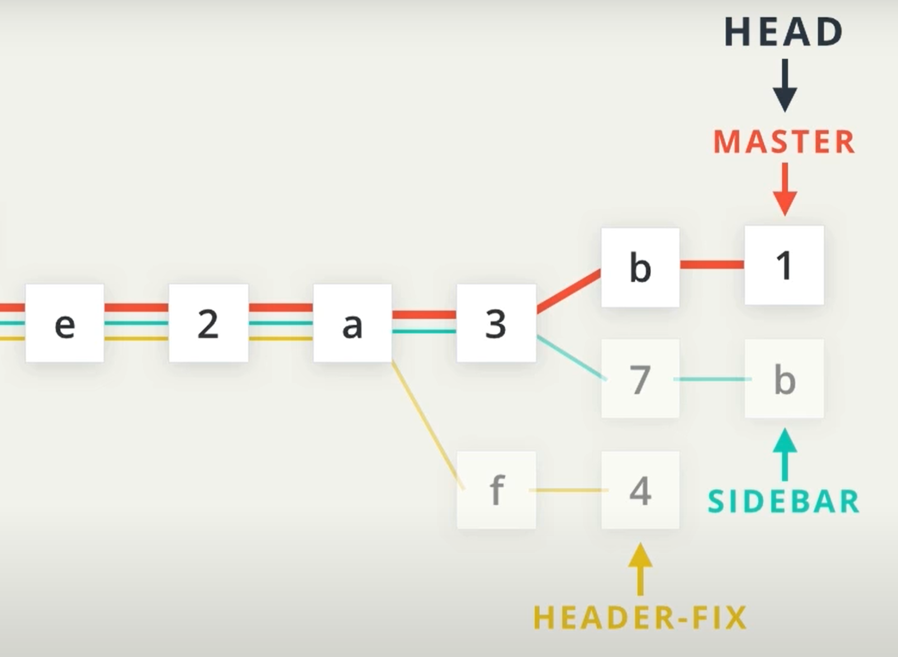

## Version Control with Github & Git

### Github vs. Git

#### Git
*Definition:*
* Distributed version-control system
  * which is a type of version control where the complete codebase — including its full version history — is mirrored on every developer's computer.
* It's for tracking changes in source code during software development
  * Understands plain text file and show changes ("human readable": the thing that computer sees is the same thing that humans see)
    * Examples: .R / .do / .tex / .md  / .txt / .csv , etc.
  * Detect changes but can't show changes in binary files ("nonhuman readable": the thing that computer sees is different than what humans see)
    * Examples: .docx / .xlxs / .pdf / .exe / .dta , etc.
  * Please refer to the parenthesis for the definition of "human readable" and "nonhuman readable"

#### Github
*Definition:*
* A webhosting service for all our files to be tracked
* A GUI software that provides user friendly access to Git

---

### Interfaces: GUI vs. CLI
#### GUI - Graphical User Interface
*Definition*:
* A system of interactive visual components of computer software
* Displays objects that convey info, represents actions that users can take
  * Example: icons, cursors, buttons
* In Github context: through Github website or desktop application

#### CLI - Command Line Interface
*Definition*:
* Processes commands to a computer program in the form of lines of text
* Normally uses terminal to enter your commands that execute user actions.
* In Github context: through Git Bash(recommended, better configurations) or your own terminal

---

#### Adding files from local computer to a remote repository

  
   
    <em>Concept Map for Adding File to Github</em>

* *Step 1:* Download a remote repository to your local **working directory**. The website is the target repo
`git clone "https://github.com/user-name/repository-name" `

* *Step 2:* Change your local directory to the right folder if you haven't already
`cd <file loaction>`

* *Step 3:* Add file to **staging area**
`git add "filename.txt"`

  Note:
 1. Add quotation marks if your file name has space in between.
 2. If you want to add all the files in your local folder to the staging area, you could do so by using `git add .`

* *Step 4:* Commit your file with a **useful commit message** to your local Git repository
`git commit -m "insert useful commit message"`

 Note: every time you commit something, it automatically generates a **commit id** that consists of random letters and numbers. For example, `521747298a3790fde1710f3aa2d03b55020575aa`

* *Step 5:* Push your committed files from local git repository to remote Github repository
`git push`

**NOTE:**
* Use `git status` to check which *branch* you are on, which file you *added*, *committed*, and *pushed*.
* Use `git pull` before you add files to sync your local repository with the remote repository. If you are working with someone on the same project, `git pull` should be the first command you run before you start working.

#### Compare different versions with `git diff`

1. Comparing working directory (WD) and staging area (SA):  
If you have just added a file to your staging area but yet made new modifications in your local working directory, you could compare the changes by just using the command  
`git diff`

2. Comparing staging area (SA) and local repository (Repo)  
This is for when you have already committed a file to a repository, but also just added an updated version to the staging area. You could do so using the command  
`git diff --staged`

3. Comparing different committed versions  
If you want to retrieve an earlier committed version, you could do so by checking their commit ids and compare with:  
`git diff id1 id2`

**NOTE:**

* `git log` Its output shows log for each commit & the commit id to use for bullet point 3
  * `git log --n` shows the last n commits
  * `git log -- graph --oneline` shows the tree structure (different branches) of previous commits.

* Reading the output for `git diff`:
> diff --git a/02_weekly_log.md b/02_weekly_log.md  
> index 831a57c..e6f5c68 100644  
> --- a/02_weekly_log.md  
> +++ b/02_weekly_log.md  
> @@ -1,7 +1,14 @@  
> -* How to use, edit, and write in Markdown format (Monday)  
> +* How to use, edit, and write in Markdown format (Monday)

  * --- a/"file_name" represents the earlier version
  * +++ b/"file_name" represents the updated versions
  * `-` in front of a line of red texts means version b deleted this part of version a
  * `+` in front of a line of green texts means version b added this part compared to version a

---

### Github Branches

It allows multiple lines of development so that people can switch between different versions or building different features at the same time without getting confused.

**Master branch:**
It's the default branch if you haven't added any other branches.

**New branches:**
It's created to either build new features or to fix some mistakes that have been made in a previous version

You can create a new branch at any commit node, but from that point on, all the commits in the new branch will not be included in the master branch.

  
   
    <em>Visualization of Branches, Source: Udacity.com</em>

#### Git commands for working with Branches

#####  Switch between branches and commits with `git checkout`

* `git checkout "branch_name"`: change to a specific branch
* `git checkout "commit id"` : change the local file to a formerly committed version
* `git checkout -b "new_branch_name"`: create a new branch
  * Afterwards, we need to use `git push --set-upstream origin <filename>` to sync our local repository to Github remote repository.

##### Look at, create new, and delete old branches with `git branch`

Two methods are equivalent.

* `git branch`: look at all the branch names
* `git branch <new_branch_name>` Create new branch
  * Need `git checkout <new_branch_name>` to switch to the newly created branch.
* `git branch -d <branch_name>`: Delete the branch name label, not necessarily the commits.
  * Remember to merge before you delete so no info is lost!

---

#### Making Pull Requests

* Pull requests: requesting that the reviewer pull my branch to another branch to merge.
* Collaboration format: one owner, multiple pull requests.
  * Step 1: checkout a new branches  
  * Step 2: add, commit, push (git push origin new-branch)
  * Step 3: go to github.com, there will be a "pull request" in the repository so that the owner can review and make comments
  * Step 4: Make changes according to the comments and then repeat Step 1-3. 

---

### Resources:
1. A list of short [Youtube videos](https://www.youtube.com/watch?v=Ytux4IOAR_s&list=PLAwxTw4SYaPk8_-6IGxJtD3i2QAu5_s_p) that talk about Git concepts, Git Bash commands, and some exercises.
2. A free [course](https://www.udacity.com/course/version-control-with-git--ud123) on *Version Control with Git*.
