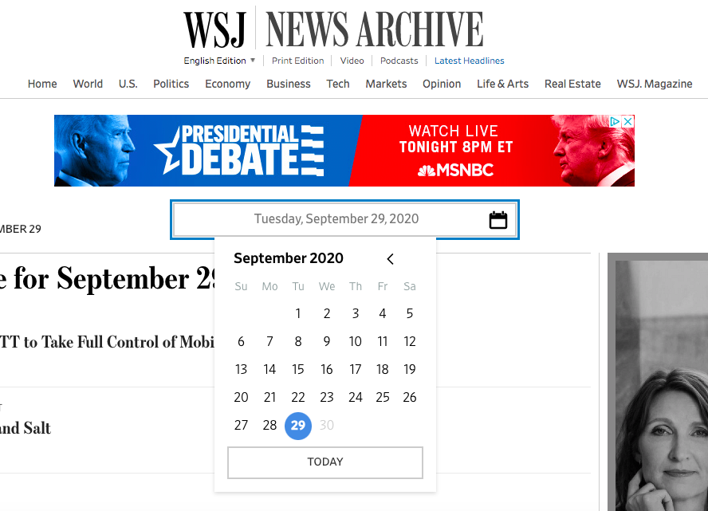

#### New York Times:
1. Go to [New York Times](https://www.nytimes.com/section/todayspaper). This will bring you to the "Today's Paper" page that archives each paper produced in the past seven volumes.

2. Sign in via your Berkeley email account.
  To create a new account with Berkeley's free subscription click [here](http://www.accessnyt.com/?fbclid=IwAR3j2rvh8olBuz5W6vSnteY4WJ3UbsTuyBoyS8zVVN7xVZZEd6Hcg7GMjfc).
3. Once you have signed in you can toggle through previous dates using the *Edition Date* dropdown.

```{r picture} 
library(knitr)
knitr::include_grahics("todayspaper.png")
```

4. From there, you are able to see highlights and the Front Page of the paper for that day. You can also toggle to other tabs that may suit your research needs.


#### Wall Street Journal:
1. Go to [Wall Street Journal News Archive](https://www.wsj.com/news/archive/2020/09/29).
2. Sign in to the Wall Street Journal with your Berkeley account. To access your free subscription and create a profile [click here](wsj.com/ASUCBerkeley).

3. Once signed in, you can toggle through previous dates and it will show you top news from that day.

```{r}

```

4. From there, you are able to see highlights and most popular paper for that day. You can also toggle to other tabs that may suit your research needs. This is not as concise as the NYT archive, however you are able to find top stories here.
