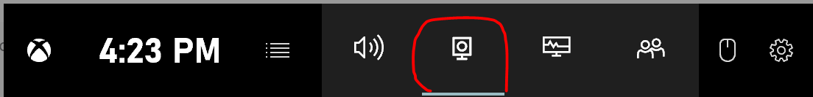
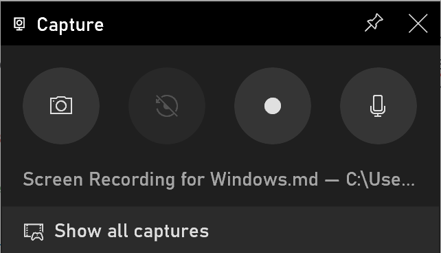

# Screen Recording Tutorial for Windows

There is a super simple built-in tool for Windows 10 to record your screen and your voice in the same app -  Xbox Game Bar.

### Step 1. Open the App that you want to record

**NOTE:** If you are making a debugging video, I highly recommend you open the knitted document or app in browser and then open your code with Github. Simply recording on RStudio might not be the best choice because any popup windows will be blocked and not shown in the video.

### Step 2. Open XBox Game Bar

Simply press the `Windows Key + G` at the same time to open XBox Game Bar

Select the second to left icon "Capture"

Turn on the microphone and press the circle icon to start recording

After you've finished recording, upload the saved file to your Google Drive and share the link.
